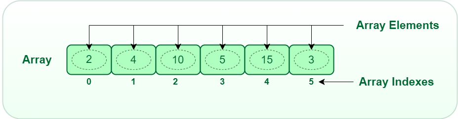
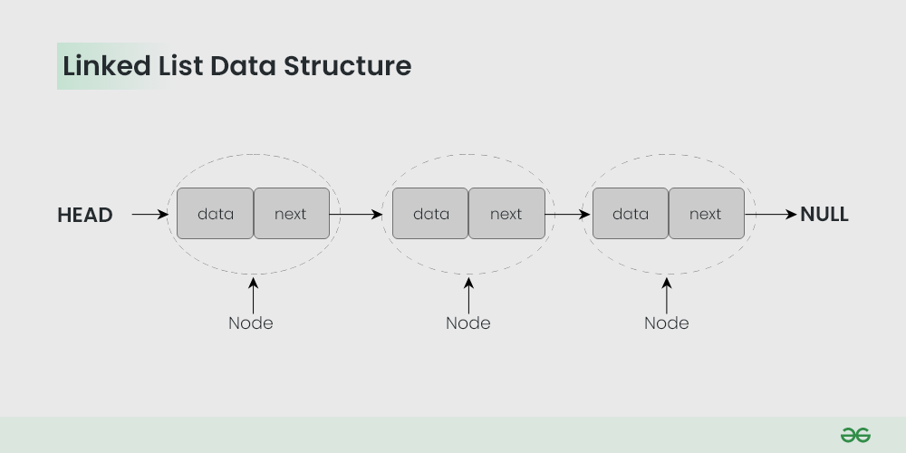
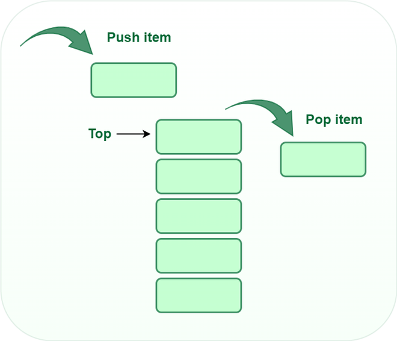
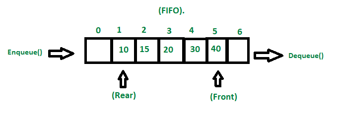

`Data Structures are mainly classified into two categories:`

Primitive Data Structures: They store the data of only one type i.e. built-in data types. Data types like integer, float, character, and booleans come in this category.

`Non-Primitive Data Structures: Data types like arrays, linked lists, trees, etc. come in this category. Non-Primitive Data Structures are data structures derived from Primitive Data Structures.`

Based on the structure and arrangement of data, these data structures are further divided into two categories

    ```
    Linear Data Structures: The data in this data structure is arranged in a sequence, one after the other i.e. each element appears to be connected linearly.

    Based on the memory allocation, the Linear Data Structures are again classified into two types:

    Based on the memory allocation, the Linear Data Structures are again classified into two types:

    ```

  `  Arrays`
An array is a powerful data structure that allows users to store and manipulate a collection of elements, all of the same data type in a single variable. Simply, it is a collection of elements of the same data type. The values get stored at contagious memory locations that can be accessed with their index number.




`Linked Lists`

In a linked list data structure, data elements are connected through a series of nodes using links or pointers. Each node contains two fields, the data field contains the actual data, and the pointer field contains the address of the next node. The pointer of the last node of the linked list have  a null pointer, as it points to nothing. The elements are stored dynamically in the linked list.



`Stack`

In the stack data structure, elements are stored according to the LIFO i.e. Last In First Out principle. As per LIFO, the last element stored in a stack will be removed first. e.g. a pile of books. Stacks can be implemented with the help of contiguous memory, an Array, and non-contiguous memory, a Linked List. 



`Queue`

In the queue data structure, elements are stored according to the FIFO i.e. First In First Out principle. As per FIFO, the first element stored in a queue will be removed first. e.g. students standing in a queue where the first student in the queue will enter first in the school. The insertion of an element in a Queue is done at one end, and the removal is done at another or opposite end. Queues can be implemented with the help of Arrays, linked lists, or stacks.




    ```Non-Linear Data Structures: The data in this data structure are not arranged in a sequence. They form a hierarchy i.e. the data elements have multiple ways to connect to other elements. e.g. tree and graph