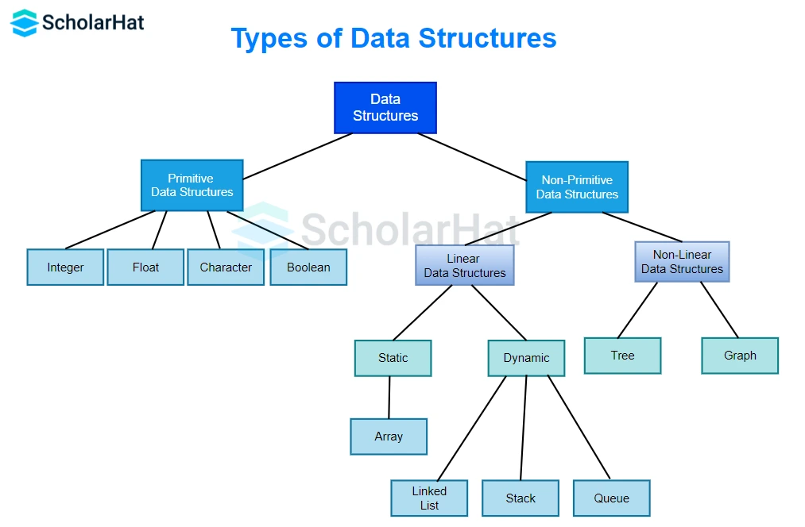

`What is the meaning of Algorithm ?`
It is a finite number of steps to solve a perticular problem
                or
Algorithm is a set of well defined instructions to solve a particular problem

    ex -Multiply Two Number
    Step 1 - take two number  -> a and b;
    Stpe 2 - take c = a * b
    Step 3 - return c

 ####    Algorithm: Calculate the square of a number

>   Start.
>   Input the number (N) whose square you want to find.
>  Multiply the number (N) by itself.
>  Store the result of the multiplication in a variable (result).
> Output the value of the variable (result), which represents the square of the input number.
> End.

> Properties of Algorithm
> -terminate after a finite time
> -produce at least one output
> -algorithm should be unambiguous
> -language independent

> ex - find the sum of N natural number

`Basic Terminologies in Data Structures`

`Data`: It is a value or a collection of values that gives you contextual information. E.g. 30 degrees C temperature of the data, roll nos of students, etc.
    
`Database`: It is a record of data. It is stored on a hard disk as compared to data structures that get stored in computer memory i.e. RAM.
    
`Elementary Items`: They are data items that are unable to be divided into sub-items. e.g. roll no. of a student.

`Entity`: It is a class of certain objects.
    Attributes: They are the specific properties of an entity.

`What is Data structure ?`

> A data structure is the organization of the data in a way so that it can be used efficiently

> data structure is specialized format for organizing ,processing , retrieving and storing data.

`Types of DS`

> 1-primitive -> Array and LinkedList
> 2-non primitive -> Stack(LIFO),Queue(FIFO),tree,graph and hashTable(Tabluar)

`What is ideal code`

> if the algorithm or code will take less space and less time then we can say that it is a ideal code.

