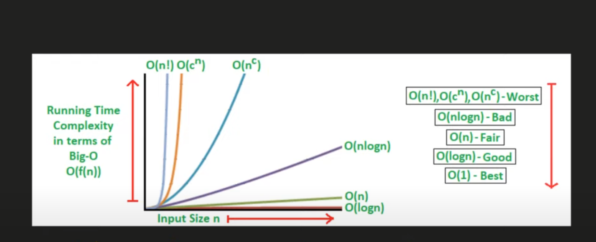

`Asymptotic Notations:`

```.Asymptotic Notations are mathematical tools that allow you to analyze an algorithm’s running time by identifying its behavior as its input size grows.

you compare space and time complexity using asymptotic notations

    There are mainly three asymptotic notations:

      - Big-O Notation (O-notation)  worst-case
      - Theta Notation (Θ-notation)  average-case
      - Omega Notation (Ω-notation)   best-case

```
`3Rules`
>Time complexity always measure in the worst case scenario
>Avoid constants
>avoid lower values
 


>There are different types of time complexities. They are:

   

    Constant Time - O(1)
    Linear Time - O(n)
    Logarithmic Time - O(log n)
    Quadratic Time - O(n^2)
    Cubic Time - O(n^3) and so on.
    
`Constant Time - O(1)`
The algorithm that has a time complexity of O(1) does not depend on the input size n. Whatever the input size may be, the runtime will always be the same.


`Linear Time - O(n)`

The algorithm has a linear time complexity when its run time increases linearly with the length of the input

`Logarithmic Time - O(log n)`
The algorithm that lowers the amount of the input data in each step has a logarithmic time complexity. This shows that the number of operations and the input size are not equal. As the input size grows, the number of operations decreases. Algorithms such as Binary Search have logarithmic time complexity.

`Quadratic Time - O(n^2)`
When the execution time of an algorithm grows non-linearly(n2) with the length of the input, the algorithm is said to have a non-linear time complexity. Algorithms with this level of time complexity include Bubble Sort.

```c
int a = 10,
int b = 20;
int c = a + b;
printf("%d",c);
```

```c
int sum = 0,
int   n = 10;

for (int i = 1; i <= n; ++i) {
    sum += i;
}
```